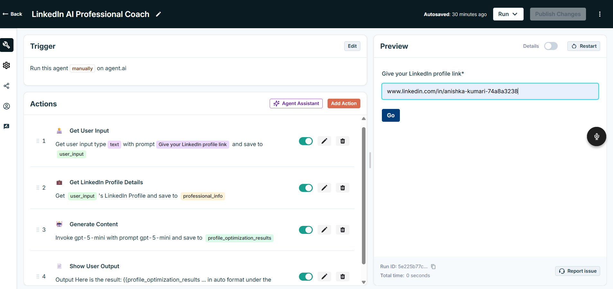
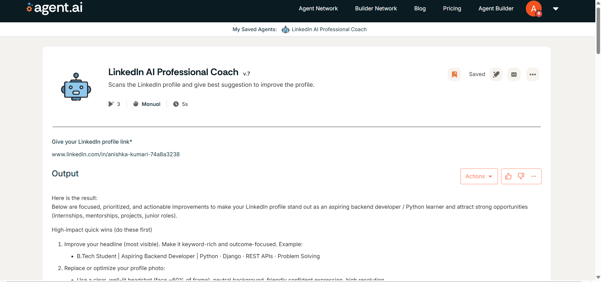
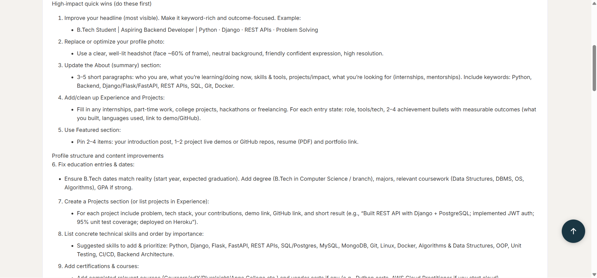
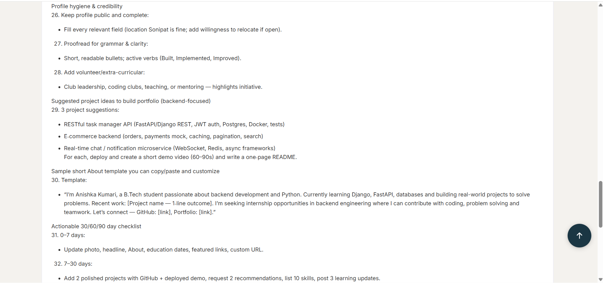

# LinkedInAI Professional Coach 🤖

An AI-powered agent that analyzes LinkedIn profiles and provides a structured roadmap to improve them.

## 🚀 Features
- Profile improvement suggestions
- Career guidance
- Personal branding tips
- Structured roadmap (Immediate, Short-term, Long-term)

## 🔗 Live Demo
👉 [Try the AI Agent](https://agent.ai/agent/jk1dm7cavt8g1e03?version_id=latest)

## 🧠 What I Learned
- Agentic AI concepts
- LLM-based workflows
- AI agents and their types

## 📸 Screenshots

### 1️⃣ User Input

### 2️⃣ AI Output (Overview)

### 3️⃣ AI Output (Details)

### 4️⃣ AI Output (Final Suggestions)

## 📌 About
This project was built as part of my learning in Agentic AI, focusing on solving real-world problems using AI.
---
